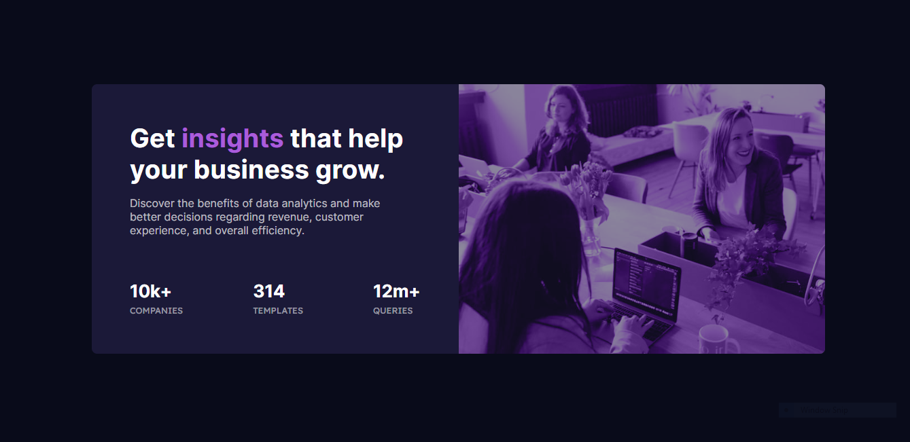

# Frontend Mentor - Stats preview card component solution

This is a solution to the [Stats preview card component challenge on Frontend Mentor](https://www.frontendmentor.io/challenges/stats-preview-card-component-8JqbgoU62). Frontend Mentor challenges help you improve your coding skills by building realistic projects. 

## Table of contents

- [Overview](#overview)
  - [The challenge](#the-challenge)
  - [Screenshot](#screenshot)
  - [Links](#links)
- [My process](#my-process)
  - [Built with](#built-with)
  - [What I learned](#what-i-learned)
  - [Useful resources](#useful-resources)
- [Author](#author)
- [Acknowledgments](#acknowledgments)

## Overview

The challenge was to recreate this component: 

### The challenge

Users should be able to:

- View the optimal layout depending on their device's screen size

### Screenshot

My solution:

### Links

- Solution URL: [Solution Link](https://www.frontendmentor.io/solutions/stats-preview-component-d7jKVrL47Z)
- Live Site URL: [Live Site](https://tombirbeck.github.io/fe-mentor-stats-preview/)

## My process

Intially I applied a small CSS reset to the page. I then added the requird fonts and created a css file where I added custom CSS variables.\
I then built out the html frame for the component with class names for the elements.\
I styled the mobile view first before moving on to the desktop view.

### Built with

- Semantic HTML5 markup
- CSS custom properties
- Flexbox
- CSS Grid
- Mobile-first workflow

### What I learned

On this project I learned about mixed-blend-mode and how it can be used to add effects to your images.

### Useful resources

- [MDN-mix-blend-mode](https://developer.mozilla.org/en-US/docs/Web/CSS/mix-blend-mode) - This helped me for XYZ reason. I really liked this pattern and will use it going forward.

## Author

- Portfolio - [Tom Birbeck](https://portfolio-tombirbeck.vercel.app/)
- Frontend Mentor - [@TomBirbeck](https://www.frontendmentor.io/profile/TomBirbeck)

## Acknowledgments

I would like to thank JoshBurri from the Frontend Mentor slack community for pointing me in the direction on mix-blend-mode when I was looking for help with that area of the challenge.

